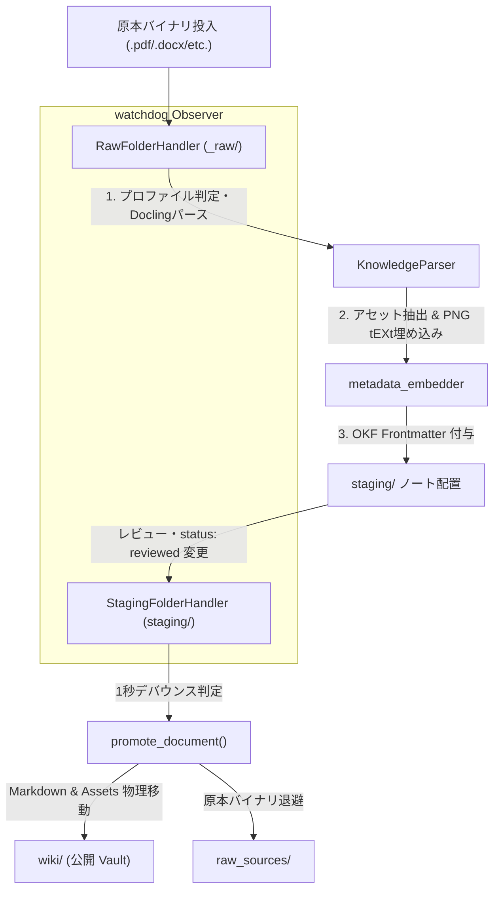

# リアルタイム監視・自動昇格デーモン (`watcher/daemon.py`)

原本投入（`_raw/`）からステージング変換（`staging/`）、および人間による承認（`status: reviewed`）を検知して公開保管庫（`wiki/`）へ昇格するプロセスを統括するバックグラウンド監視デーモン。

## アーキテクチャ構成

## 主要コンポーネント

1. **`RawFolderHandler`**:
   - `_raw/` 配下のファイル生成・変更イベントを検知。
   - サポート拡張子（`.pdf`, `.docx`, `.pptx`, `.xlsx`）を対象に、決定論的スラッグ（`generate_slug`）およびプロファイル（`resolve_profile`）を解決。
   - `wiki/` 内に既に同一スラッグの `reviewed` ノートが存在する場合は処理をスキップ（冪等性の保護）。
   - Docling パース、プロファイル固有後処理、アセット抽出・画像メタデータ（PNG `tEXt` チャンク）埋め込みを実行し、`staging/` に配置。

2. **`StagingFolderHandler`**:
   - `staging/` 配下の Markdown ファイルの変更イベントを監視。
   - **1秒デバウンス制御**: 連続書き込みによる多重トリガーを抑制。
   - YAML ヘッダーの `status` が `reviewed` に更新されたノートを検知し、`promote_document()` を呼び出し。

3. **`promote_document()` (`core/promoter.py`)**:
   - `staging/` から `wiki/` への Markdown ノートおよび抽出アセットフォルダの物理移動 (`shutil.move`)。
   - 既存同名ノート・アセットが存在する場合はタイムスタンプ付き `.bak` として非破壊退避。
   - 用語自動抽出（`GlossaryExtractor`）と WikiLink 自動相互結合（`WikiRelinker`）を昇格フックとして実行。
   - 原本バイナリを `_raw/` から `raw_sources/` へ退避。
   - Git リポジトリへのセマンティックコミットを実行。
