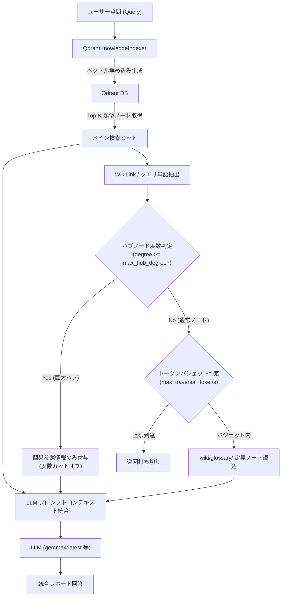

# Qdrant ベクトル検索 ＆ 1-Hop WikiLink グラフ巡回インフラ仕様

`wikid-steward` のハイブリッド検索基盤は、単なるベクトル類似度検索にとどまらず、ナレッジノート間の WikiLink (`[[用語名]]`) を辿るグラフ巡回（1-Hop Graph Traversal）と LLM 要約を統合した Graph-RAG アーキテクチャを採用しています。

## 検索フロー概要

## 主要モジュール

### 1. `OpenAICompatibleEmbeddingClient` & `QdrantKnowledgeIndexer` (`vector/indexer.py`)
- Ollama / OpenAI / vLLM などの汎用エンドポイント経由でテキストブロックを多次元ベクトル化。
- Markdown 本文を段落単位でチャンク化（`uuid5` による決定論的 ID 生成）。
- コレクション（`wikid_steward_knowledge`）の自動構成と Cosine 類似度による upsert 登録。

### 2. `WikiGraphSearchEngine` (`vector/searcher.py`)
- **ベクトル検索**: クエリの埋め込みを生成し、Qdrant から類似度の高い Top-K チャンクを抽出。
- **WikiLink 抽出**: ヒットしたコンテキスト内の `[[用語名]]` を自動抽出。
- **巨大ハブノード度数制御 (Degree Cutoff)**:
  - ナレッジ全体での言及回数（Degree）が `max_hub_degree`（デフォルト: 25）を超える用語は、巨大ハブとして本文全文の読み込みをバイパスし、簡易参照に縮約。
- **トークンバジェット制御 (Token Budget Control)**:
  - 1-Hop 巡回で読み込む用語定義ノートの累積トークン数が `max_traversal_tokens`（デフォルト: 1200）に達した時点で自動打ち切り。
- **LLM 統合回答生成**:
  - メイン検索ヒット情報と 1-Hop 巡回で得られた専門用語定義を合成し、網羅的かつ文脈の深いレポート回答を出力。
